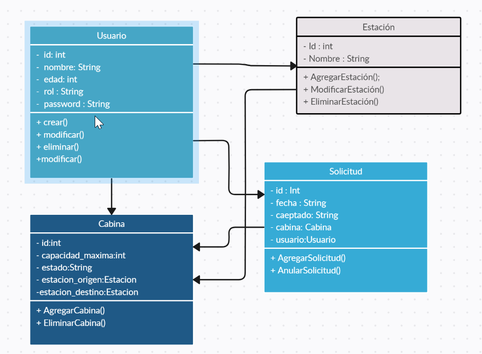
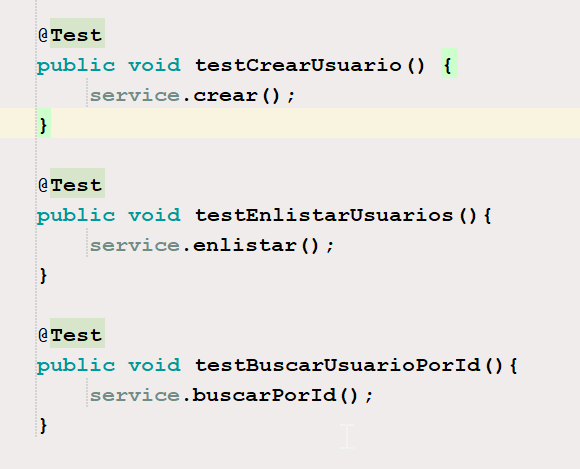
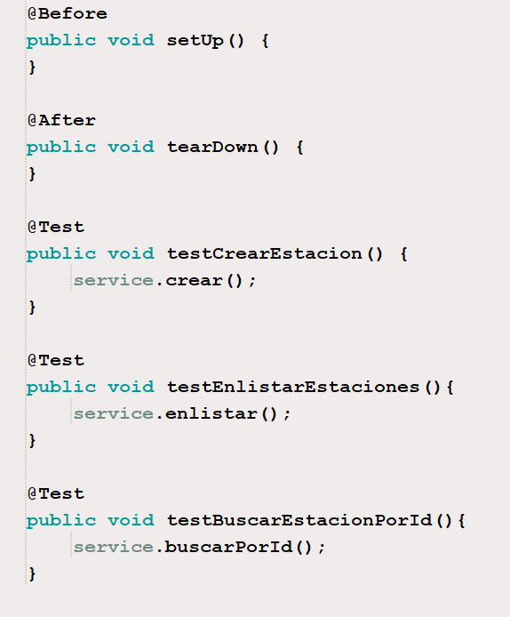
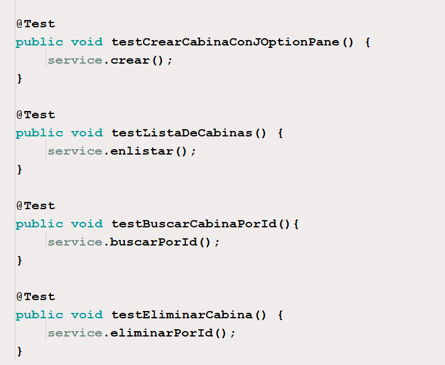

# Sistema de control teleférico

El objetivo es diseñar un sistema que administre las operaciones de un teleférico, incluida la gestión de las cabinas y los usuarios.

Un teleférico es un medio de transporte utilizado en áreas montañosas o turísticas para transportar personas de una ubicación a otra mediante cabinas suspendidas en cables. El sistema de control del teleférico debe ser capaz de gestionar múltiples cabinas y usuarios.

## Diseño

## Pruebas Unitarias

### tipos de casos de pruebas
*de carga
*de limites
*datos validos
*datos no validos
*datos de excepciones

### descripciones
*para los casos de carga todos tienen el mismo proceso y la carga es limitada dependiendo de hasta cuantos datos desean colocar en un archivo
*en este sistema no hay limites, se pueden colocar nueros inferiores a cero y superiores a cero tambien
*los datos son validos siempre y cuando se cumplan las condiciones de las otras clases o las condiciones de los campos de las clases
*los datos no validos se hicieron en los registros de los datos, es muy probable que se puedan colocar numeros en los datos que piden colocar cadenas de texto pero genera error cuando se digitan datos de letras en los datos que guardan variables numericas
*hay excepciones de autorización no se pueden hacer algunas cosas, sin ser administrador o auxiliar

### pasos
*el paso para crear archivos y cargarlos es simple, despues hay que implementar esos metodos en cada una de las clases
*a medida que creaba los campos de identificación no pude implementar una forma de hacerlos autoincrementales, por lo que me ví en la obligación de aceptar el metodo de agregacion de datos de identificadores de modo libre

### Resultados
*los resultados de carga funcionan correctamente y tiene un gran almacenamiento
*los resultados de limites no tiene limitaciones
*los resultados de datos validos funcionan siempre y cuando se cumplan ciertas condiciones
*los resultados de datos invalidos se activan normalmente en el registro de datos
*los resultados de excepciones se aplican en la autorizacion, funcionan correctamente

### pruebas

iniciar aclarando que en cada una de las pruebas se presenta un codigo limpio

